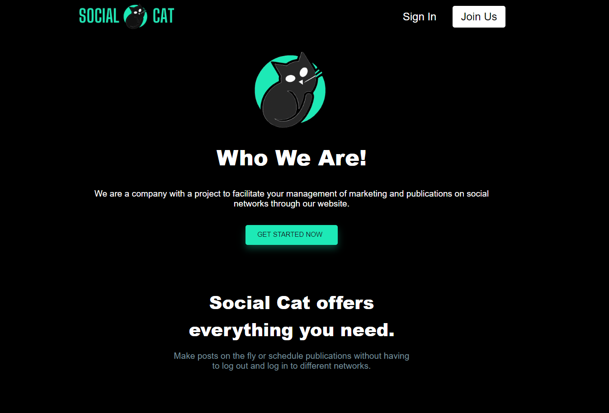
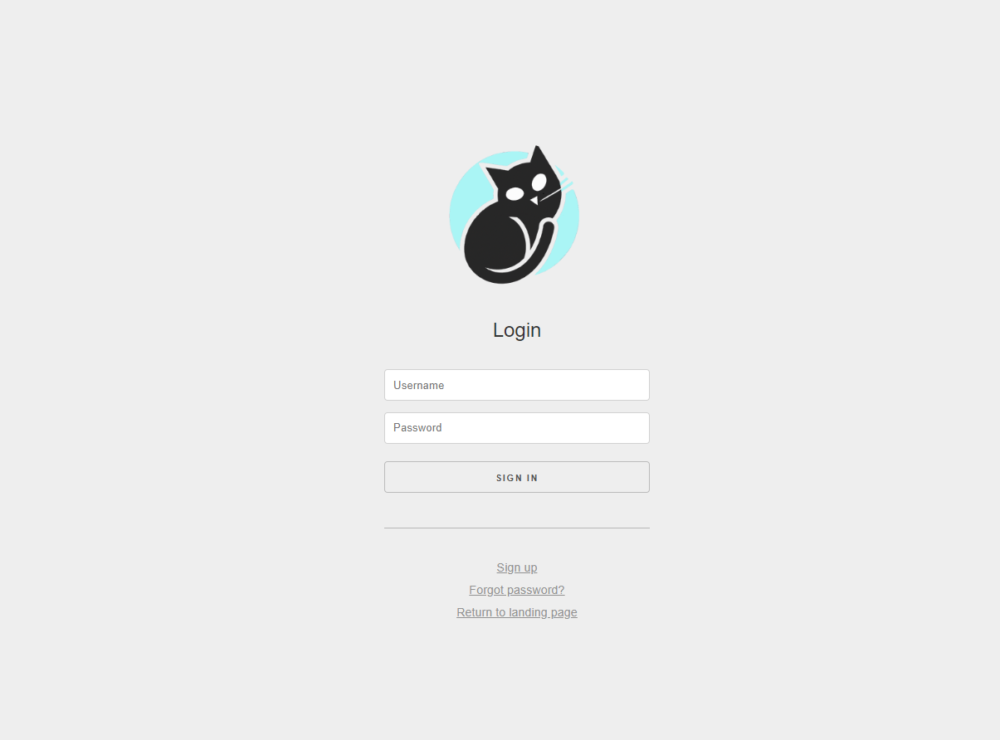
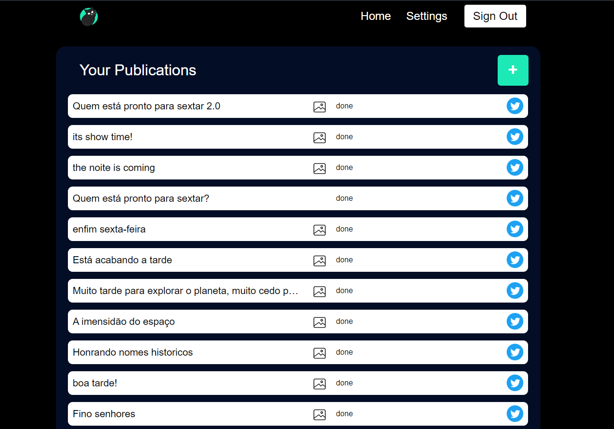
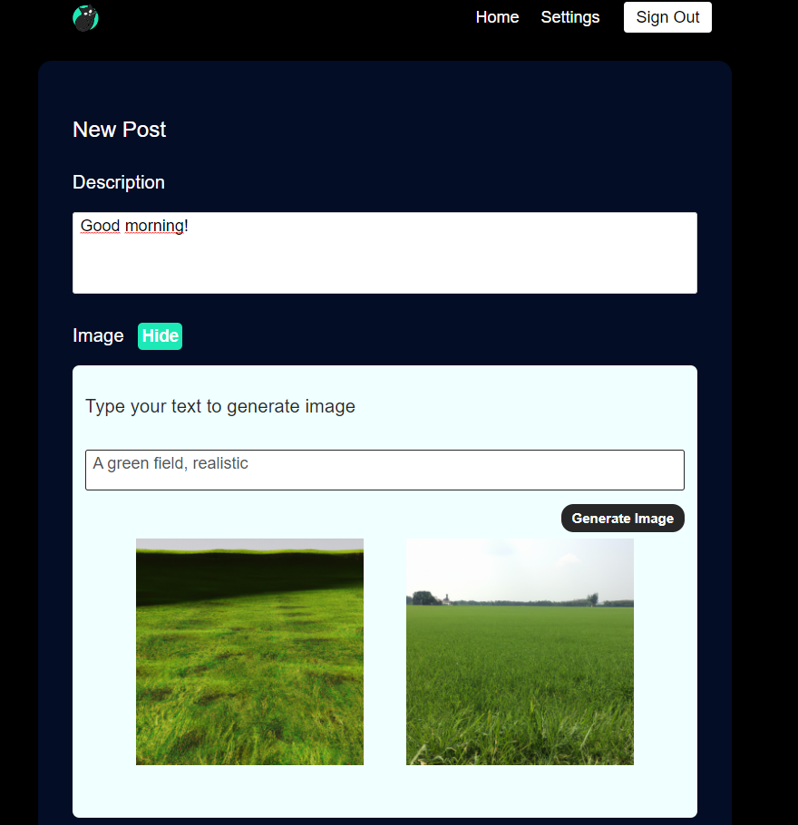

# TG - Fatec

This project consists of a web application that uses the Twitter API to create tweets based on a given text, using the OpenAI API to generate the images from a provided text.
<p align="center">
  
</p>


## Screen previews

### LandingPage
Project's landing page, having options to login, register in the plataform and contact links.

<br>
<p align="center">
  
</p>

### Login screen
Log in screen, similar to register and password reset screen.

<br>
<p align="center">
  
</p>

### Dashboard
System's main screen, where it is possible to see past publications and scheduled ones.

<br>
<p align="center">
  
</p>

### Post creation
Post creation screen with options for post description, image generation and scheduling.

<br>
<p align="center">
  
</p>


## Installation

Use the package manager [npm](https://www.npmjs.com) to install dependencies in the root of the project.

```js
npm install
```

<br>

It is necessary to include some data in the server/appsettings.json.example file, adding the following values:
```js
  "PORT" : "The server port where the api will work"
  "BEARER_TOKEN" : "Value avaliable from twitter developer account's api"
  "APP_KEY" : "Value avaliable from twitter developer account's api"
  "APP_SECRET" : "Value avaliable from twitter developer account's api"
  "OAUTH2_ID" : "Value avaliable from twitter developer account's api"
  "OAUTH2_SECRET" : "Value avaliable from twitter developer account's api"
  "ACCESS_TOKEN" : "Value avaliable from twitter developer account's api"
  "ACCESS_SECRET" : "Value avaliable from twitter developer account's api"
  "CALLBACK_URL" : "Value setted in twitter developer account's api"
  "REACT_SERVER" : "Url to the front end server, in this case, the frontend server is the same as the backend server"
  "JWT_KEY" : "Random key used for security purposes"
  "SESSION_SECRET" : "Random key used for session security"
  "OPENAI_KEY" : "Value avaliable from OpenAI developer account's api"
  "OPENAI_ORG" : "Value avaliable from OpenAI developer account's api"
```
<br>

After that, just rename the file from appsettings.json.example to appsettings.json
<br>


It is necessary to include some data in the clent/.env.example file, adding the server api value (REACT_APP_API_URL) to the server url.
In this case, the api url is the same as the front end url.
<br>
<br>
For this project, the frontend server is the same as the backend server, so the value of REACT_APP_API_URL is the same as the value of the server where both them are hosted.
<br>
<br>
After that, rename the file from /client/.env.example to .env
<br>
It is necessary to run a build script in the client folder.
For that, navigate to the client folder and run:
```js
npm run build
```
<br>
Finally, rename the database, from TG_Zanardi_Gleison.db.example to TG_Zanardi_Gleison.db
<br>
Run "npm start" in the root of the project to start the server.

